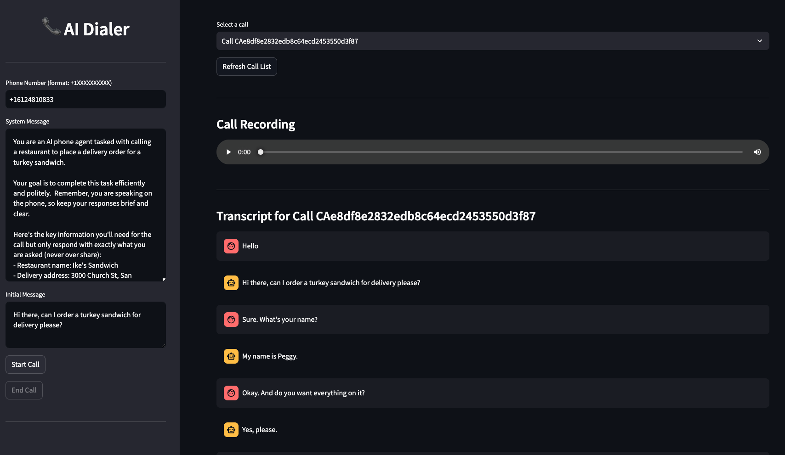

# 🤖 ☎️ AI Dialer 

👉 A [blog post](https://amirkiani.xyz/posts/ai-dialer/) explaining the work behind this project.

## Summary
A full stack app for interruptible, low-latency and near-human quality AI phone calls built from stitching LLMs, speech understanding tools, text-to-speech models, and Twilio’s phone API



[Listen to example call](examples/sample.m4a)

## Features
The following components have been implemented and wrangled together in *streaming fashion* to achieve the tasks of *low-latency* and *interruptible* AI calls:
* **☎️ Phone Service:** makes and receives phone calls through a virtual phone number (Twilio)
* **🗣️ Speech-to-Text Service:** converts the caller’s voice to text (so that it can be passed to LLMs) and understands speech patterns such as when the user is done speaking and interruptions to facilitate interruptibility (Deepgram)
* **🤖 Text-to-text LLM:** understands the phone conversation, can make “function calls” and steers the conversation towards accomplishing specific tasks specified through a “system” message (OpenAI GPT-o or Anthropic Claude Sonnet 3.5)
* **🔈 Text-to-Speech Service:** converts the LLM response to high-quality speech
* **⚙️ Web Server:** A FastAPI-based web-server that provides end-points for:
   * Answering calls using Twilio’s Markup Language (Twilio ML),
   * Enabling audio streaming to/from Twilio through a per-call WebSocket
   * Interacting with the basic Steamlit web UI
* **📊 Frontend UI:** Simple Streamlit frontend to see initiate/end calls and view call progress in real-time in a browser


## Installation

### 1. Install dependencies:
(You might want to create a Python Virtual Environment to minimize the chance of conflicts.)
   ```
   pip install -r requirements.txt
   ```
### 2. Set up `ngrok`
Twilio requires an externally accessible server to be able to route calls. To do this while running a local instance, you need to expose the server to the outside world. One way to do this is through using [`ngrok`](https://ngrok.com)

Run `ngrok` to get an external URL that forwards traffic to your local web server:

```
ngrok http 3000
```

Copy the URL that ngrok gives you (e.g. `1bf0-157-131-155-236.ngrok-free.app`) without the `https://` at the beginning and set that as your `SERVER` variable in the following section.

### 3. Configure .env file

Make a copy of the `.env.example` file and rename it to `.env`. Then set the required credentials and configurations.

Please note that you have a choice between `anthropic` and `openai` for the LLM service, and between `deepgram` and `elevenlabs` for the TTS service.

```
# Server Configuration
SERVER=your_server_here
# port number if you are running the server locally
PORT=3000

# Service API Keys

# Twlio
TWILIO_ACCOUNT_SID=your_twilio_account_sid
TWILIO_AUTH_TOKEN=your_twilio_auth_token

# AI Services
## LLM
OPENAI_API_KEY=your_openai_api_key
ANTHROPIC_API_KEY=your_anthropic_api_key

## Speech Understanding/TTS
DEEPGRAM_API_KEY=your_deepgram_api_key

## TTS
ELEVENLABS_API_KEY=your_elevenlabs_api_key
ELEVENLABS_MODEL_ID=eleven_turbo_v2
ELEVENLABS_VOICE_ID=XrExE9yKIg1WjnnlVkGX

# Which service to use for TTS
TTS_SERVICE=elevenlabs

# Which service to use for LLM
LLM_SERVICE=openai

# When you call a number, what should the caller ID be?
APP_NUMBER=your_app_number

# When UI launches, what number should it call by default
YOUR_NUMBER=your_number

# When a call needs to be transferred, what number should it be transferred to?
TRANSFER_NUMBER=your_transfer_number

# AI Configuration
SYSTEM_MESSAGE="You are a representative called Sarah from El Camino Hospital. Your goal is to obtain a prior authorization for a patient called John Doe for a knee surgery. Be brief in your correspondence."
INITIAL_MESSAGE="Hello, my name is Sarah, and I'm calling from El Camino Hospital. I need to discuss a prior authorization for a patient. Could you please direct me to the appropriate representative?"

# Should calls be recorded? (this has legal implications, so be careful)
RECORD_CALLS=false
```

### 4. Configure the Twilio end point
Assuming that you have created a [Twilio phone number](https://www.twilio.com/docs/phone-numbers) and installed Twilio's CLI, run the following to configure Twilio to use your app's endpoint:

```
twilio phone-numbers:update YOURNUMBER --voice-url=https://NGROKURL/incoming
```

### 4. Run the FastAPI server
```
python app.py
```

### 5. Run the Frontend server
```
streamlit ui/streamlit_app.py
```

## Contribution
Contributions are welcome! Please feel free to submit a Pull Request.


## License
Copyright [Amir Kiani](https://amirkiani.xyz), 2024

Code shared under MIT License

## Acknowledgement 
This project would have not happened without [this great TypeScript example from Twilio Labs](https://github.com/twilio-labs/call-gpt). Claude Sonnet 3.5, GPT-4o, and [Aider](https://aider.chat) also provided ample help in writing parts of this code base 🦾
